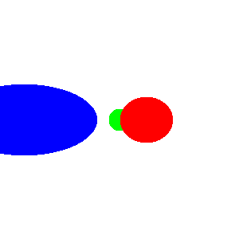

# Ray tracing

Graphical library for generating 2D images from 3D scenes.

## Current state

Generating random set of pixels and saving them to the `.ppm` format.

Run the following command to generate an image:

```bash
$ zig run main.zig 2> assets/image.ppm
```

