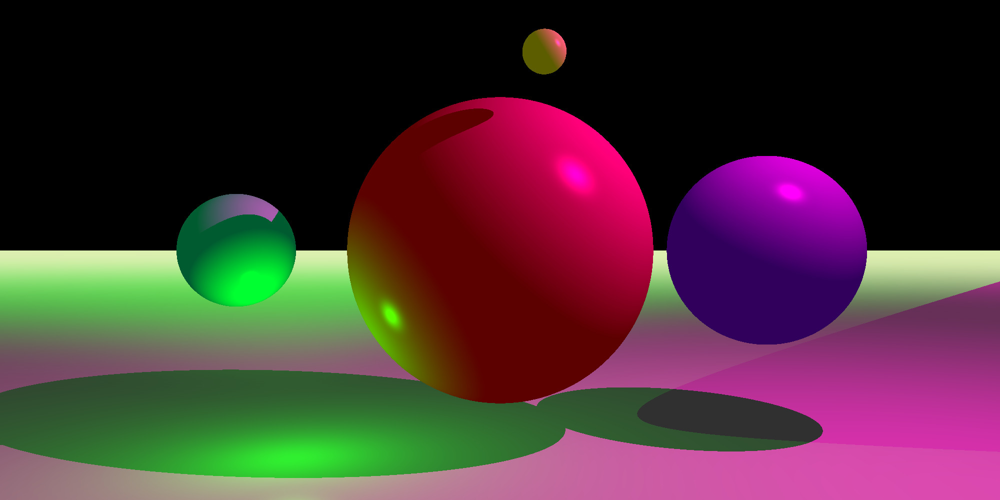

# Ray tracing

Graphics library for generating 2D images from 3D scenes.

## Current state

Rendering several illuminated spheres painted in different colors. The light might be blocked by other spheres, resulting in a shadow.

Run the following command to generate an image:

```bash
$ zig run src/main.zig -- src/scenes/spheres.json output
```

where:

`src/scenes/spheres.json` - manifest file that describes objects' placement on the scene

`output` - folder that will be created to store the resulting images (one image per camera)


